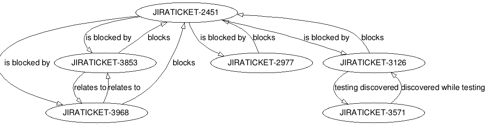

conflugraph
=====================

Graph visualizer for page hierarchy of a Confluence space

Uses Confluence REST API for fetching information on spaces. Authorized with NTLM (although it's possible to change authorization methods easily)
Uses graphviz for graphical presentation

[//]: # Example output
[//]: # ==============

[//]: # 

Requirements:
=============
* Python 2.7+
* [requests](http://docs.python-requests.org/en/master/)
* [ntlm-auth](https://pypi.org/project/ntlm-auth/)
* [requests-ntlm](https://pypi.org/project/requests_ntlm/)
* [graphviz](https://pypi.org/project/graphviz/)

Docker support is still a work in progress

Usage:
======
```bash
$ git clone https://github.com/vineetparikh/conflugraph.git
$ cd conflugraph
$ sudo -H pip install -r requirements.txt
$ python jira-dependency-graph.py --user=your-jira-username --password=your-jira-password --jira=url-of-your-jira-site issue-key
```

```
# e.g.:
$ python jira-dependency-graph.py --user=pawelrychlik --password=s3cr3t --jira=https://your-company.jira.com JIRATICKET-718

Fetching JIRATICKET-2451
JIRATICKET-2451 <= is blocked by <= JIRATICKET-3853
JIRATICKET-2451 <= is blocked by <= JIRATICKET-3968
JIRATICKET-2451 <= is blocked by <= JIRATICKET-3126
JIRATICKET-2451 <= is blocked by <= JIRATICKET-2977
Fetching JIRATICKET-3853
JIRATICKET-3853 => blocks => JIRATICKET-2451
JIRATICKET-3853 <= relates to <= JIRATICKET-3968
Fetching JIRATICKET-3968
JIRATICKET-3968 => blocks => JIRATICKET-2451
JIRATICKET-3968 => relates to => JIRATICKET-3853
Fetching JIRATICKET-3126
JIRATICKET-3126 => blocks => JIRATICKET-2451
JIRATICKET-3126 => testing discovered => JIRATICKET-3571
Fetching JIRATICKET-3571
JIRATICKET-3571 <= discovered while testing <= JIRATICKET-3126
Fetching JIRATICKET-2977
JIRATICKET-2977 => blocks => JIRATICKET-2451

Writing to issue_graph.png
```
Result:



Advanced Usage:
===============

List of all configuration options with descriptions:

```
python jira-dependency-graph.py --help
```

### Configuring Splines
While this doesn't matter as much with small graphs, as graphs scale with nodes and edges, edges tend to overlap nodes rather annoyingly. Fixing this, especially for bigger graphs, means configuring splines, but this vastly increases rendering time.

```bash
$ python jira-dependency-graph.py --user=your-jira-username --password=your-jira-password --jira=url-of-your-jira-site --exclude-link 'is required by' --exclude-link 'duplicates' issue-key
```


### Authentication

This tool configures NTLM authentication, as this was required for testing with Cornell's Confluence system. However, it's fairly easy to port between authentication types.

